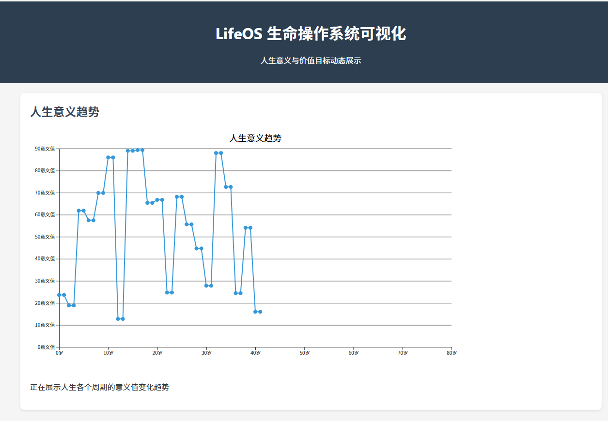
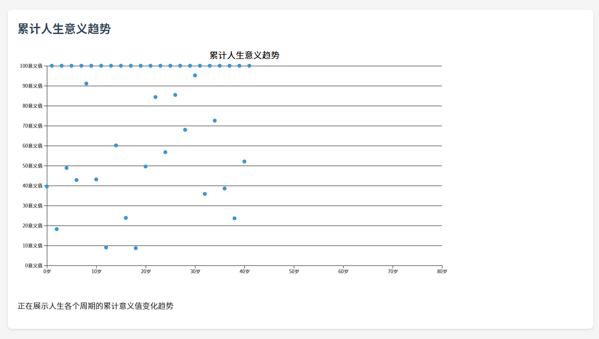
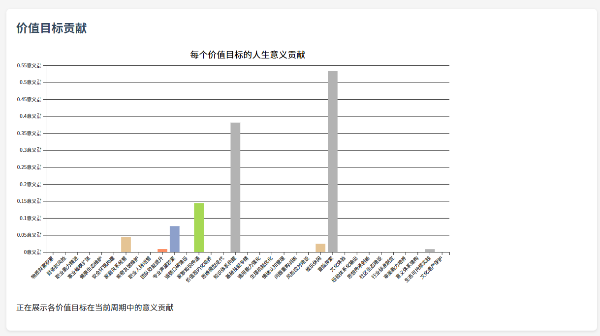
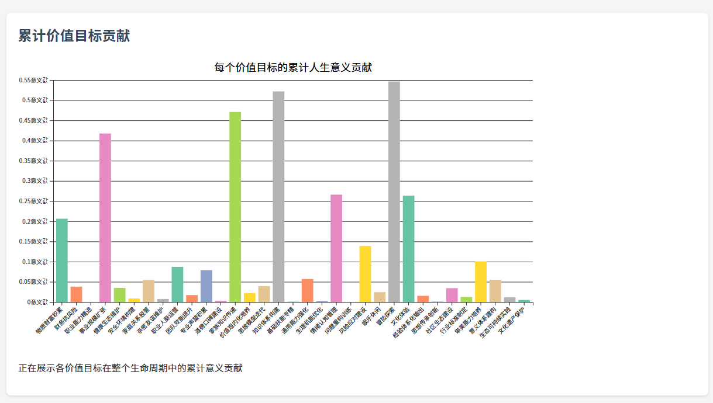
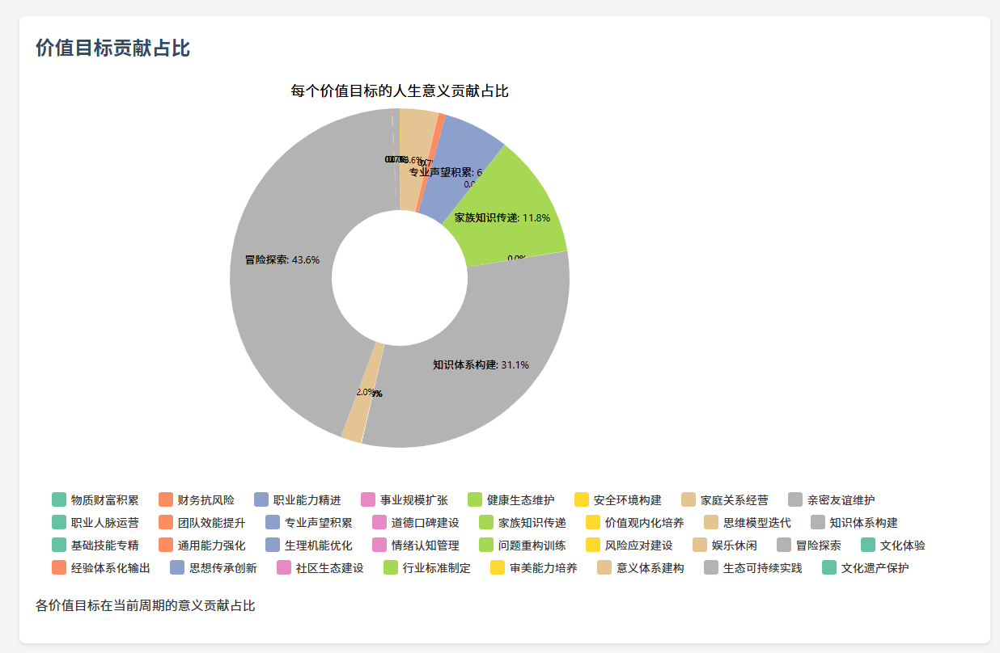
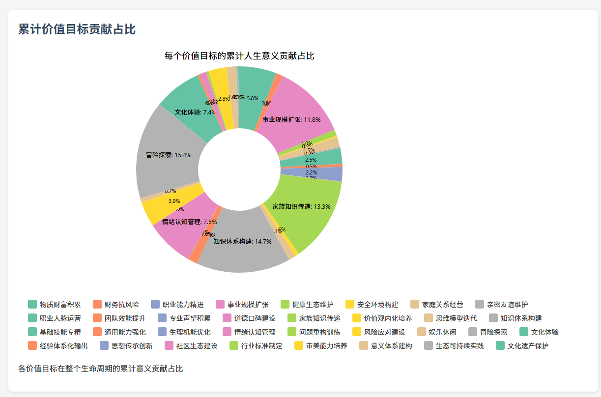
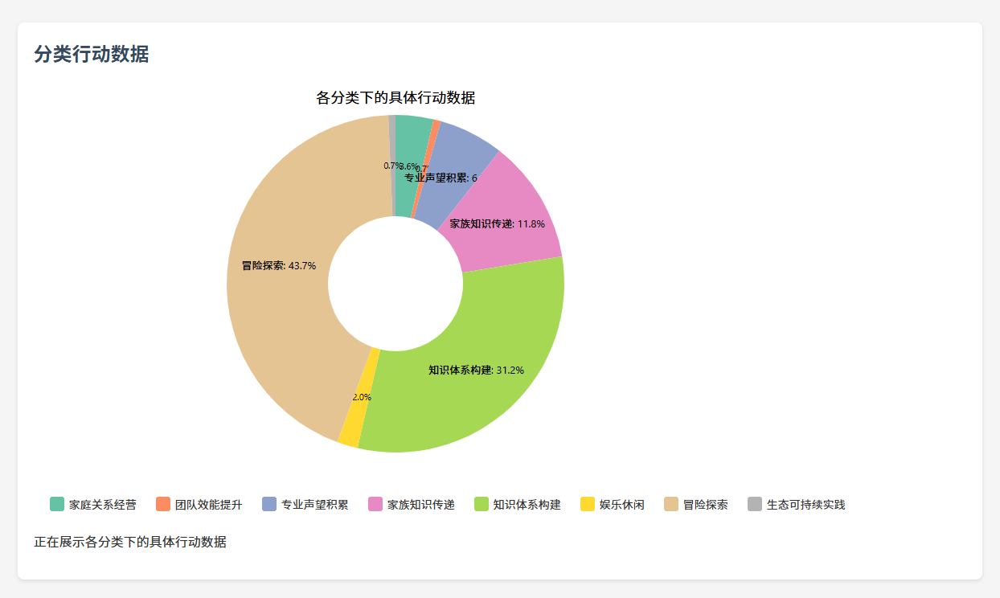
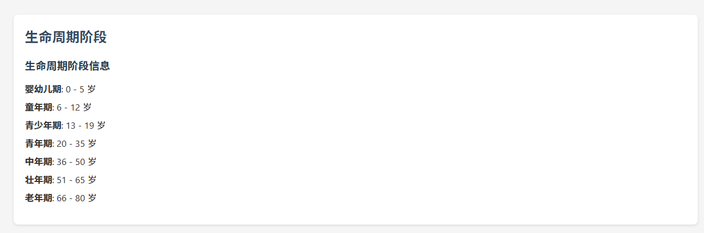
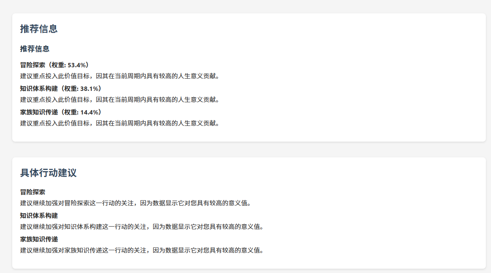

# LifeOS 是什么
这是一个根据 [[人生观]] 设计的软件系统，通过“感知→分析→预测→决策→行动→反馈→反思→校准”的循环，动态计算生命的意义，并不断调整个人行为，帮助人更好地管理自己的人生计划。

# LifeOS 主要管理的业务对象

##  价值目标 ValueGoal 相关的业务对象

### 价值目标分类 ValueGoalCategory

组织 *价值目标 ValueGoal*  的分类，分类间使用 *[Taxonomy 分类自...子]* 关系以便组成树状层级的分类关系。

### 价值目标 ValueGoal

构成个人 [[价值观]] 的基本要素，*价值目标 ValueGoal* 要相对具体以便可以落实到具体的人生行动（如价值目标：家庭关系经营）。*价值目标 ValueGoal* 与 *价值目标分类 ValueGoalCategory* 间使用 *[Categorization 归属于...]* 关系，将目标归属到目标分类。

### 价值目标体系 ValueSystemPriority

价值目标体系由分类（ValueGoalCategory）和具体（ValueGoal）目标组成，结构要符合 MECE 原则。每个目标有两个属性：重要度权重（归一化）和衰减因子（随时间减少）。目标体系会随个人认知和环境变化，但结构要稳定，才能比较人生意义，既可与他人比，也可与自己不同阶段比。

## 行动 Action 相关的业务对象

### 行动分类 MetaActionCategory

组织行动的分类，作用与 *价值目标分类 ValueGoalCategory* 应该考虑统一建模。

### 元行动 MetaAction

元行动是日常行动的模板，帮助制定规范，并与价值目标建立因果关系，便于管理和选择更有意义的行动，同时用来计算生命的意义。
元行动的模版特性，为日常行动的反馈信息采集提供了规范和可行的技术路线。

*元行动 MetaAction* 主要的属性有：

- **pv** （plan value）行动工作价值量。人的生命有限，可以由生命时间来度量价值应该是个可行的方案，假设 80 年为标准寿命是满分价值
- **interaction** 行动间的协同/拮抗效应关系
- **effectiveness**有效性，**priority**优先级，**recommendation**推荐度……等用于管理和检索*元行动 MetaAction* 
- **cau** 因果关系属性  *[Causation 因果导致关系...]* 。`MetaAction`-(cau)→`ValueGoal`
- **cat** 归属于关系属性  *[Categorization 归属于...]*。`MetaAction`-(cat)→`MetaActionCategory`

### 关系类 MetaActionCausationValueGoal

元行动与价值目标的关系对象，属性包括：

- **causationPair**  因果导向关系对儿 `MetaAction`-(cau)→`ValueGoal`
- **weight** 因果导向关系的影响度权重
- **confidence** 置信度
- **time_lag** 因果导向关系时间延迟，比如以年为每个仿真循环为单位 1

### 关系类 MetaActionInteractionMetaAction

元行动间的协同/拮抗效应关系对象，属性包括：

- **interactionPair** 协同/拮抗效应对儿 `MetaAction`←(Interaction)→`MetaAction` 
- **weight** 行动间协同/拮抗效应关系权重，取值 -1 到 1

### 行动 Action

具体的日常行动，构成周期行动计划的基本要素。规划、执行和记录日常行动的事实数据，主要属性有：

- **metaAction** 派生自的 MetaAction。如果值为 `None` 说明是特例行动，`description`/`pv`/`ac`/`ev` 等采集和维护很难做到自动化
- **description** 行动的描述，主要在规划阶段用于定义和描述行动
- **pv**、**ac**（Actual Cost）、**ev**（Earning Value） 几个 EVM 挣值管理的数据，其中 **pv** 可以从派生自的 metaAction 得到，其他的是事实采集数据
- **achievement_rate** 目标达成率，默认 $achievement\_rate=ev/pv$，用户根据实际情况微调
- **note** 行动过程和行动后的记录
- 另外的一些行动有关的时间属性，比如：计划开始时间、计划结束时间、实际开始时间、实际结束时间
- **status** 行动状态，如：未开始、进行中、已结束、重开、延期

*所有业务对象都应该支持多维分类，这一点与 MetaAction 应该一致*

### 行动计划 ActionPlan

由 Action 组成的周期性行动计划，主要属性：

- **actions** 实际行动集合，复杂的可以考虑“前驱后继”等关系
- **note** 行动计划过程和行动后的记录，例如可以由 AI 根据相关信息自动填写完整

## 人生意义 Lifemeaning 相关的业务对象

### 人生意义 Lifemeaning

由 *行动计划 ActionPlan* 执行后经过算法计算后得出的量化的人生意义数值，主要属性有：

- **created_at** 创建时间，用于时间切片的各种统计。复杂的可以增加 `updated_at` 更新时间，适应用户主观修改人生意义数值的场景
- **action_plan** 相关联的行动计划对象
- **value_system_priority** 相关的价值目标体系对象
- **life_meaning** 每轮的行动计划执行后的人生意义数值

人生意义数值的计算算法：

$$
life\_meaning=\sum_{0,0}^{i,j}{(pv_{actions_{i}} \times achievement\_rate_{actions_{i}} \times weight_{MetaActionCausationValueGoal_{i,j}}  \times confidence_{MetaActionCausationValueGoal_{i,j}} \times weight_{valueGoal_{j}})} 
$$

### 累计人生意义 CumulativeLifemeaning

由 *人生意义 Lifemeaning* 累加同时要考虑 *价值目标 ValueGoal* 的衰减因子，是当前的时间的人生意义累计值 

$happiness == cumulativeLifemeaning$ 幸福喜悦和累计的人生意义是等价的

塞利格曼的 PERMA 理论说，幸福来自五个方面：  

1. **积极情绪 Positive Emotion**：保持快乐和感恩。  
2. **投入 Engagement**：做自己热爱的事，享受过程。  
3. **人际关系 Relationship**：和他人建立真诚的关系。  
4. **意义 Meaning**：找到人生目标，活出价值。  
5. **成就 Accomplishment**：设定并实现目标，获得满足感。  
   幸福不是靠运气，而是靠这些方面一起努力。

累计人生意义的计算方法：

$$
cumulativeLifemeaning=\sum_{age_{born}=0}^{age_{death}}{(life\_meaning_{age}-\sum_{j_{valuegoal}=0}^{j}{(decay\_factor_{j} \times lifemeaning_{(age-1,j)})})}
$$

# LifeOS 系统设计

## LifeOS 的目标和价值

- 个人 [[价值观]] 结构化体系化，通过不断迭代越来越清晰化自己的生活态度、人生目的和价值体系，回答 “我是谁？” 和 “我最终要往哪里去？我的使命是什么？”
- 基于个人 *价值目标体系 ValueSystemPriority* 、*元行动* 最佳实践库和过往经验，制定和决策行动计划、执行和采集行动数据、反思和总结行动结果，回答 “我现在要去哪？” 和 “我去到的地方怎么样？我干得怎么样？”
- 通过“感知→分析→预测→决策→行动→反馈→反思→校准”的闭环迭代过程，打磨、精进个人的认知框架（[[世界观]]），回答“世界的本质是什么？”和“我与世界的关系是什么”

## LifeOS 的场景和流程

- TBD
- ……
- ……

## LifeOS 的功能

- LifeOS 基础数据
  - 个人*价值目标体系 ValueSystemPriority* 构建，周期可能是每5年、每10年
  - 基于个人*价值目标体系 ValueSystemPriority* 下的 *价值目标 ValueGoal* 重要度权重评估，定义衰减因子 ，周期可能是每1年、每半年
  - 基于最佳实践的个人 *元行动 MetaAction* 库构建和维护，定期从云上（未来 LifeOS 的 SaaS）同步，AI 监控和检查给出优化改善建议，基于特例行动 *Action* AI 归纳总结推荐新建 *MetaAction*，周期是按需、随时
  - 构建`MetaAction`-(cau)→`ValueGoal` 因果导致关系矩阵，定期从云上同步，AI 持续监控检查并给出优化建议
  - 构建 `MetaAction`←(Interaction)→`MetaAction`  协同/拮抗效应矩阵，定期从云上同步，AI 持续监控检查并给出优化建议
- LifeOS 日常生活、体验、学习行动
  - 有节奏性地制定 *行动计划 ActionPlan* 并坚持执行，周期应该是每个月、每个季度
    - *行动计划 ActionPlan* 制定应该由 AI 给与足够的支持，依据个人*价值目标体系 ValueSystemPriority* 和经验数据、依据优化设计算法给出 *累计人生意义 CumulativeLifemeaning* 增长最快的 *行动计划 ActionPlan* 方案
  - *行动计划 ActionPlan* 执行和数据采集，以及每个 *实际行动 Action* 结果的反思和总结
    - 尽量通过可穿戴设备和智能手机，通过 *MetaAction* 形成采集数据链范式，自动化地、客观地、减少人为干预地搜集 *实际行动 Action* 的事实数据
    - *实际行动 Action* 结果的反思和总结可以是 AI 引导式对话和深度思考，然后同步完成反思和总结（得出 $achievement\_rate=ev/pv$ 值），尽量减少对自律的依赖
- LifeOS 人生意义计算、优化设计、仿真
  - *life_meaning* 和 *CumulativeLifemeaning* 的计算、管理、维护
  - 以  *CumulativeLifemeaning* 最大值为目标的优化算法，给出 年龄 $age$ 段 *行动计划 ActionPlan* 建议方案
  - 执行基于优化算法的仿真并保存基线，随着后续*行动计划 ActionPlan*的执行，与真实数据做对比分析，利用 AI 的交互分析进行反思总结，然后再不断修正“基础数据”、“日常行动”、“仿真参数”
- LifeOS 修行、回忆、体验、平和、幸福
  - 构建个人笔记、**KS (Knowledge System) 知识架构体系**、**KGM (Knowledge Graph Map) 知识导航地图**、**KP (Knowledge Particle) 知识元胞** 使个人的认知框架（[[世界观]]）不断趋近于本质真理
  - 不同方式回忆不同 年龄 $age$ 段的经历和感受，增加人生的意义感，体验幸福


### 项目结构
```
README.md
manage.py
requirements.txt
visualization.html
.idea/
 .gitignore
 LifeOS.iml
 inspectionProfiles/
 misc.xml
 modules.xml
 vcs.xml
 workspace.xml
venv/
 .gitignore
 CACHEDIR.TAG
 Lib/
 Scripts/
 pyvenv.cfg
LifeOS/
 __init__.py
 __pycache__/
 asgi.py
 common/
 conf/
 settings.py
 urls.py
 wsgi.py
goal/
 __init__.py
 __pycache__/
 admin.py
 apps.py
 lifeos_script.py
 migrations/
 models.py
 simulation_output.json
 tests.py
 urls.py
 values.json
 your_gui_code.py
```

### 主要业务对象
#### 价值目标（ValueGoal）相关
- **价值目标分类（ValueGoalCategory）**：用于组织价值目标，分类间使用 *[Taxonomy 分类自...子]* 关系组成树状层级。
- **价值目标（ValueGoal）**：构成个人价值观的基本要素，相对具体以便落实到人生行动，与价值目标分类间使用 *[Categorization 归属于...]* 关系。
- **价值目标体系（ValueSystemPriority）**：由分类和具体目标组成，结构符合 MECE 原则，每个目标有重要度权重和衰减因子，目标体系会随个人认知和环境变化，但结构稳定以便比较人生意义。

#### 行动（Action）相关
- **行动分类（MetaActionCategory）**：组织行动的分类，作用与价值目标分类类似。
- **元行动（MetaAction）**：日常行动的模板，与价值目标建立因果关系，便于管理和选择有意义的行动，同时用于计算生命的意义。主要属性包括行动工作价值量（pv）、行动间的协同/拮抗效应关系（interaction）、有效性（effectiveness）、优先级（priority）、推荐度（recommendation）、因果关系属性（cau）和归属于关系属性（cat）。
- **关系类 MetaActionCausationValueGoal**：元行动与价值目标的关系对象，属性包括因果导向关系对儿（causationPair）、因果导向关系的影响度权重（weight）、置信度（confidence）和因果导向关系时间延迟（time_lag）。
- **关系类 MetaActionInteractionMetaAction**：元行动间的协同/拮抗效应关系对象，属性包括协同/拮抗效应对儿（interactionPair）和行动间协同/拮抗效应关系权重（weight）。
- **行动（Action）**：具体的日常行动，构成周期行动计划的基本要素。主要属性包括派生自的元行动（metaAction）、行动描述（description）、EVM 挣值管理的数据（pv、ac、ev）、目标达成率（achievement_rate）、行动记录（note）、行动时间属性和行动状态（status）。
- **行动计划（ActionPlan）**：由行动组成的周期性行动计划，主要属性包括实际行动集合（actions）和行动计划记录（note）。

#### 人生意义（Lifemeaning）相关
- **人生意义（Lifemeaning）**：由行动计划执行后经过算法计算得出的量化的人生意义数值，主要属性包括创建时间（created_at）、关联的行动计划对象（action_plan）、相关的价值目标体系对象（value_system_priority）和每轮行动计划执行后的人生意义数值（life_meaning）。
- **累计人生意义（CumulativeLifemeaning）**：由人生意义累加同时考虑价值目标的衰减因子，是当前时间的人生意义累计值，幸福喜悦和累计的人生意义等价。

### 代码文件
- **README.md**：项目的说明文档，介绍了项目的基本信息、主要业务对象和人生意义的计算算法。
- **manage.py**：Django 项目的管理脚本，用于执行各种管理命令。
- **requirements.txt**：项目依赖的 Python 包列表。
- **visualization.html**：可能用于可视化项目数据的 HTML 文件。
- **LifeOS/**：项目的主要应用目录，包含项目的配置文件、URL 路由和 ASGI、WSGI 配置等。
- **goal/**：与目标管理相关的应用目录，包含模型定义、迁移文件、测试文件和 URL 路由等。

### 相关依赖库代码
仓库的虚拟环境（`venv`）中包含了 Django 相关的依赖库代码，涉及消息存储、密码哈希、数据库操作、地理信息系统（GIS）支持等功能。这些代码为项目提供了基础的功能支持。

### 总结
`LifeOS` 项目是一个具有创新性的人生管理软件系统，通过定义各种业务对象和关系，实现了对人生目标、行动和意义的量化管理。项目使用 Django 作为后端框架，结合相关依赖库提供了丰富的功能。使用 D3.js 实现数据可视化，提供了丰富的用户界面。




















